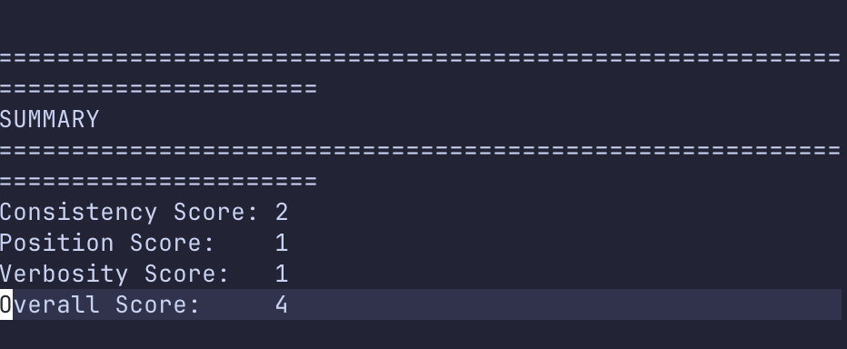

# LLM Judge Evaluator

A lightweight tool to judge a judge. 

## Why?

LLM judges are used to rank responses, but how reliable are they? This evaluator checks:
- **Consistency**: Does it pick the *ideal* response when it's Response 1?
- **Position bias**: Does it pick the *ideal* response when it's Response 2?
- **Verbosity**: Does it stay consistent when responses are rephrased?

## Usage
- Install dependencies `pip install requirements.txt`
- check `dummy.env` and create a `.env` file 
- you may use `fetch_dataset` to get a sample dataset or create one. You need `task`, `rubrics`, `ideal_response` and `negative_response`. Check `input.csv`.
- run `python judge.py \
  --model inception/mercury-2.5 \
  --input input.csv \
  --openai-params '{"temperature":1,"max_output_tokens":2000}' \
  --provider-params '{"reasoning":{"effort":"low"},"provider":{"zdr":true,"data
_collection":"deny"}}'`
- use model and settings as per your needs

**f you find this useful, consider starring the repo. I might add more metrics.**

**Connect with me on linkedin if you have a project i can help with.I am a freelancer trying to solve gen ai related issues.**
https://www.linkedin.com/in/mayankladdha31/

**This is not an official evaluation suite**
